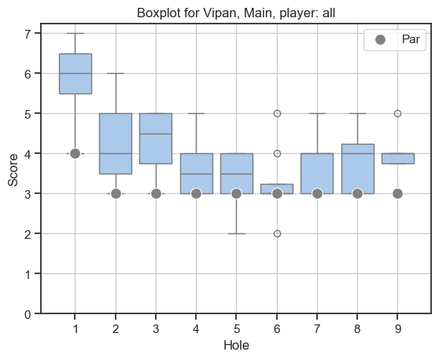

# UDisc Stats Analyzer

UDisc Stats Analyzer is a Python-based application that imports and analyzes CSV
score data exported from UDisc — the popular disc golf score tracking app. It
processes player and course data to generate detailed statistics, helping disc
golf enthusiasts gain insights into their gameplay and performance trends.

## Usage

### Prerequisites

Set up your Python environment by installing the required Python packages. It is
recommended to do this in a virtual environment in order to not pollute your
default Python environment.

Create and enter a virtual environment:

```
python3 -m venv venv
source venv/bin/activate
```

Now, install the required Python packages:

```
pip install -r requirements.txt
```

Your Python environment is now ready to use UDisc Stats Analyzer!

### Prepare UDISC CSV files

Use the UDisc app to download the CSV files you want to analyze.

Move the CSV files into a separate directory named e.g., `score_cards`.

### Average Plot

Plot the average score for a specific course by running the `average_plot.py`
script.

Here is an example use of `average_plot.py` to plot the averages per hole for
course "Vipan", layout "Main" for all players:

```
python average_plot.py --csv-dir score_cards --course Vipan --layout Main
```

Here is an example of how that graph can look:



It is also possible to specify a player:

```
python average_plot.py --csv-dir score_cards --course Vipan --layout Main --player 'Isak ”Bush Walker” Jacobsson'
```

For more help on how to use the `average_plot.py` script run the help command:

```
python average_plot.py -h
```
