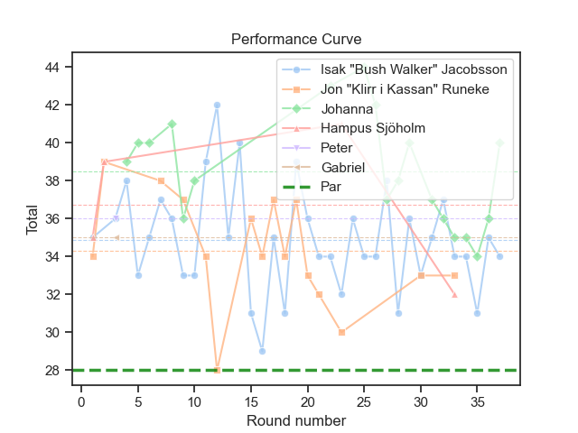

# UDisc Stats Analyzer

UDisc Stats Analyzer is a Python-based application that imports and analyzes CSV
score data exported from UDisc — the popular disc golf score tracking app. It
processes player and course data to generate detailed statistics, helping disc
golf enthusiasts gain insights into their gameplay and performance trends.

This repository contains a Python script to generate different types of stats
based on your UDisc golf games. Follow the [Setup](#setup) to install the
prerequisit Python packages and preparing your UDisc CSV files for analysis.

After completing the setup, continue to the [Analysis](#analysis) section to
learn about the different analytics, and how to use them.

## Setup

### Prerequisites

Set up your Python environment by installing the required Python packages. It is
recommended to do this in a virtual environment in order to not pollute your
default Python environment.

Create and enter a virtual environment:

```
python3 -m venv venv
source venv/bin/activate
```

Now, install the required Python packages:

```
pip install -r requirements.txt
```

Your Python environment is now ready to use UDisc Stats Analyzer!

### Prepare UDisc CSV Files

Use the UDisc app to download the CSV files you want to analyze.

Move the CSV files into a separate directory named e.g., `score_cards`.

## Analysis

The udisc_analysis.py script lets you generate different kinds of analytics from
your UDisc data. Use a subcommand to select the type of analysis you want to
run.

### Common Arguments

All subcommands require that you pass the directory path to where you have
your UDisc CSV files:

`-d/--csv-dir` - Path to the directory containing UDisc CSV files.

It is possible apply filters to what data to process. The common filters
available for every subcommand are:

> [!NOTE]
>
> For some subcommands, certain filters are required.

- `-c/--course` - Course name to filter by.
- `-l/--layout` - Layout name to filter by.
- `-p/--player` - Player name(s) to filter by (can be used multiple times,
  e.g., -p Alice -p Bob). Will default to 'All'.
- `--after` - Only include data after this date (inclusive). Format: YYYY-MM-DD.
- `--before` - Only include data before this date (inclusive). Format:
  YYYY-MM-DD.

### Hole Distribution

Plot the hole distribution with the `hole-distribution` subcommand.

This subcommand will generate a boxplot with the distribution per hole for a
specific course and layout.

Provide the directory containing the UDisc CSV files, course, and layout. Here
is an example:

```
python udisc_analysis.py hole-distribution --csv-dir score_cards --course Vipan --layout Main
```

Which generates a plot, such as:


#### Additional Arguments

- `-o/--output` - Path to save the plot image (e.g., 'plot.png'). When set, the
plot is not shown.
- `--hide-par` - Hide par reference in plot.

### Performance Curve

Plot performance curve with the `performance-curve` subcommand.

This subcommand will generate a lineplot of the score per round for a specific
stat, such as total round score or a specific hole. It is possible to choose
what player(s) to draw lines for.

Provide the directory containing the UDisc CSV files, and course, layout. When
not specifiying a stat, it defaults to "Total". Here is an example:

```
python udisc_analysis.py performance-curve --csv-dir score_cards --course Vipan --layout Main
```

Which generates a plot, such as:



#### Additional Arguments

- `-o/--output` - Path to save the plot image (e.g., 'plot.png'). When set, the
plot is not shown.
- `-s/--stat` - What stat to plot, e.g., Total, Hole1, Hole18.
- `--x-axis-mode` - Choose 'date' to plot against actual dates or 'round' to
  plot by round number.
- `--hide-par` - Hide par reference in plot.
- `--hide-avg` - Hide average lines in plot.
- `--smoothness` - Apply rolling average on plot.

### Score Distribution

Plot the score distribution with the `score-distribution` subcommand.

This subcommand will generate a pie plot for the score distribution, i.e., what
percentage of your holes are birdies, pars, bogeyes and so on.

Provide the directory containing the UDisc CSV files. Here is an example:

```
python udisc_analysis.py score-distribution --csv-dir score_cards
```

Which generates a plot, such as:


#### Additional Arguments

- `-o/--output` - Path to save the plot image (e.g., 'plot.png'). When set, the
plot is not shown.
### Basic Stats

Print basic stats with the `basic-stats` subcommand.

This subcommand will print basic stats, such as number of rounds, number of
holes, number of throws, etc.

Provide the directory containing the UDisc CSV files. Here is an example:

```
python udisc_analysis.py basic-stats --csv-dir score_cards
```

Which prints:

```
----- Basic overview -----
Rounds: 41
Finished rounds: 28
Best round: 28p
Worst round: 42p
Average total: 36.46p
Score change per round played: -0.04p
Holes: 293
Throws: 1199

Jon "Klirr i Kassan" Runeke:
    Rounds: 9
    Finished rounds: 6
    Best round: 28p
    Worst round: 39p
    Average total: 35.00p
    Score change per round played: -1.31p
    Holes: 63
    Throws: 248

Isak "Bush Walker" Jacobsson:
    Rounds: 18
    Finished rounds: 12
    Best round: 33p
    Worst round: 42p
    Average total: 36.00p
    Score change per round played: 0.19p
    Holes: 131
    Throws: 537

...
```
