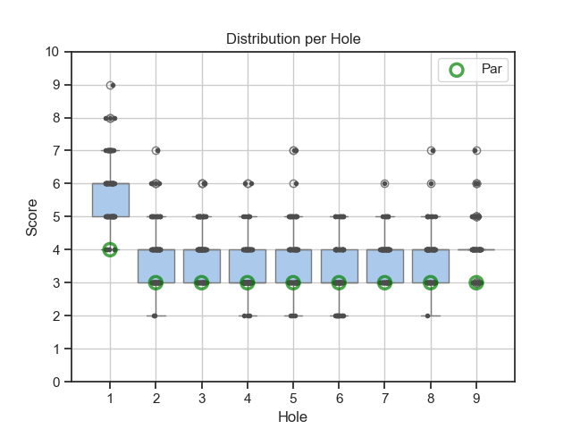

# UDisc Stats Analyzer

UDisc Stats Analyzer is a Python-based application that imports and analyzes CSV
score data exported from UDisc — the popular disc golf score tracking app. It
processes player and course data to generate detailed statistics, helping disc
golf enthusiasts gain insights into their gameplay and performance trends.

This repository contains a Python script to plot different types of stats based
on your UDisc golf games. Follow the [Setup](#setup) to instal the prerequisit
Python packages and preparing your UDisc CSV files for analysis.

After completing the setup, continue to the [Analysis](#analysis) section to
learn about the different analytics, and how to use them.

## Setup

### Prerequisites

Set up your Python environment by installing the required Python packages. It is
recommended to do this in a virtual environment in order to not pollute your
default Python environment.

Create and enter a virtual environment:

```
python3 -m venv venv
source venv/bin/activate
```

Now, install the required Python packages:

```
pip install -r requirements.txt
```

Your Python environment is now ready to use UDisc Stats Analyzer!

### Prepare UDisc CSV Files

Use the UDisc app to download the CSV files you want to analyze.

Move the CSV files into a separate directory named e.g., `score_cards`.

## Analysis

The udisc_analysis.py script lets you generate different kinds of analytics from
your UDisc data. Use a subcommand to select the type of analysis you want to
run:

### Hole Distribution

Plot the hole distribution with the `hole-distribution` subcommand.

This subcommand will generate a boxplot with the distribution per hole for a
specific course and layout. It is possible to choose what player(s) to include
in the plot.

Here is an example use for course "Vipan" and layout "Main" for all players.
Remember to always specify the directory containing your UDisc CSV files:

```
python udisc_analysis.py hole-distribution --csv-dir score_cards --course Vipan --layout Main
```

Which generates a plot, such as:



#### Arguments

- `-d/--csv-dir` - Path to the directory containing UDisc CSV files.
  **Required**
- `-c/--course` - Course name to filter by. **Required**
- `-l/--layout` - Layout name to filter by. **Required**
- `-p/--player` - Player name(s) to filter by (can be used multiple times,
  e.g., -p Alice -p Bob). Will default to 'All'.
- `--after` - Only include data after this date (inclusive). Format: YYYY-MM-DD.
- `--before` - Only include data before this date (inclusive). Format:
  YYYY-MM-DD.
- `-o/--output` - Path to save the plot image (e.g., 'plot.png'). If not
  provided, the plot is only shown.
- `--hide-par` - Hide par reference in plot.

### Performance Curve

Plot performance curve with the `performance-curve` subcommand.

This subcommand will generate a lineplot of the score per round for a specific
stat, such as total round score or a specific hole. It is possible to choose
what player(s) to draw lines for.

Provide the directory containing the UDisc CSV files, course, layout, and
optionally the player(s) to plot for. By default all players with at least one
record of the selecet stat will be plotted. When not specifiying a stat, the
subcommand will generate a plot for the total round score. Here is an example:

```
python udisc_analysis.py performance-curve --csv-dir score_cards --course Vipan --layout Main
```

Which generates a plot, such as:


#### Arguments

- `-d/--csv-dir` - Path to the directory containing UDisc CSV files.
  **Required**
- `-c/--course` - Course name to filter by. **Required**
- `-l/--layout` - Layout name to filter by. **Required**
- `-p/--player` - Player name(s) to filter by (can be used multiple times,
  e.g., -p Alice -p Bob). Will default to 'All'.
- `--after` - Only include data after this date (inclusive). Format: YYYY-MM-DD.
- `--before` - Only include data before this date (inclusive). Format:
  YYYY-MM-DD.
- `-o/--output` - Path to save the plot image (e.g., 'plot.png'). If not
  provided, the plot is only shown.
- `-s/--stat` - What stat to plot, e.g., Total, Hole1, Hole18.
- `--x-axis-mode` - Choose 'date' to plot against actual dates or 'round' to
  plot by round number.
- `--hide-par` - Hide par reference in plot.

### Score Distribution

Plot the score distribution with the `score-distribution` subcommand.

This subcommand will generate a pie plot for the score distribution, i.e., what
procentage of your holes are birdies, pars, bogeyes and so on. By default the
subcommand will plot the combined distribution for all players and all courses,
but it is possible to specify those to get a filtered distribution.

An example use of the subcommand is seen below. Remember to always specify the
directory containing your UDisc CSV files:

```
python udisc_analysis.py score-distribution --csv-dir score_cards
```

Which generates a plot, such as:


#### Arguments

- `-d/--csv-dir` - Path to the directory containing UDisc CSV files.
  **Required**
- `-c/--course` - Course name to filter by. Will default to 'All'.
- `-l/--layout` - Layout name to filter by. Will default to 'All'.
- `-p/--player` - Player name(s) to filter by (can be used multiple times,
  e.g., -p Alice -p Bob). Will default to 'All'.
- `--after` - Only include data after this date (inclusive). Format: YYYY-MM-DD.
- `--before` - Only include data before this date (inclusive). Format:
  YYYY-MM-DD.
- `-o/--output` - Path to save the plot image (e.g., 'plot.png'). If not
  provided, the plot is only shown.

### Basic Stats

Print basic stats with the `basic-stats` subcommand.

This subcommand will print basic stats, such as number of rounds, number of
holes, and number of throws. By default the subcommand will print basic stats
for all players and all courses.

An example use of the subcommand is seen below. Remember to always specify the
directory containing your UDisc CSV files:

```
python udisc_analysis.py basic-stats --csv-dir score_cards
```

Which prints:

```
----- Basic overview -----
Rounds: 32
Holes: 225
Throws: 934
```

#### Arguments

- `-d/--csv-dir` - Path to the directory containing UDisc CSV files.
  **Required**
- `-c/--course` - Course name to filter by. Will default to 'All'.
- `-l/--layout` - Layout name to filter by. Will default to 'All'.
- `-p/--player` - Player name(s) to filter by (can be used multiple times,
  e.g., -p Alice -p Bob). Will default to 'All'.
- `--after` - Only include data after this date (inclusive). Format: YYYY-MM-DD.
- `--before` - Only include data before this date (inclusive). Format:
  YYYY-MM-DD.
